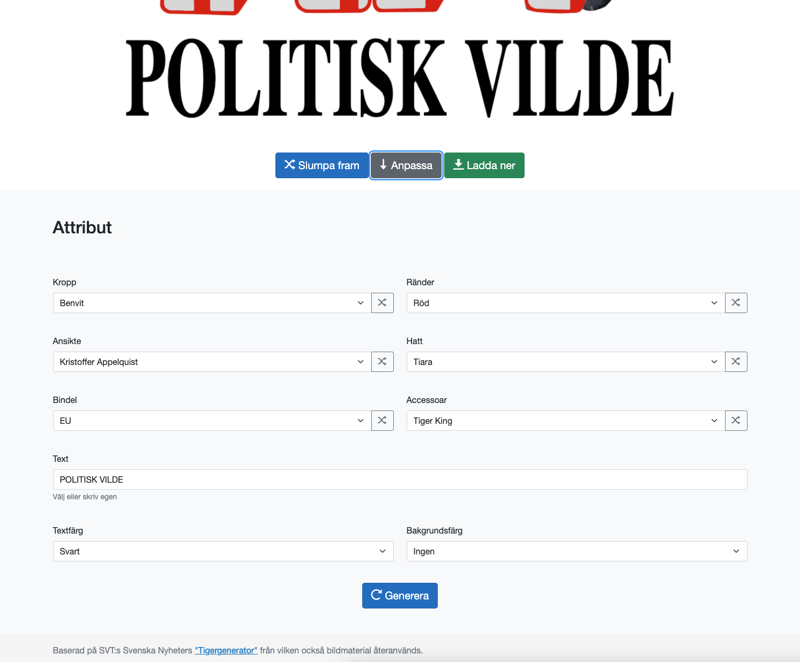

# Tigergenerator

Syftet med denna app är att främja satir och ett bättre samtalsklimat där man kan ta upp allt.

Denna app är i sig en utökning av humorprogrammet *Svenska nyheters* [Tigergenerator](https://tiger.svt.se/). Den återanvänder bilder men lägger också till egna.

Tack till SVT och de andra personerna bakom. Utan deras initiativ så hade denna webapp aldrig blivit till.

## Bakgrund

["En svensk tiger"](https://sv.wikipedia.org/wiki/En_svensk_tiger) är en symbol från 1941 som skapades av illustratören [Bertil Almqvist](https://sv.wikipedia.org/wiki/Bertil_Almqvist) (1902- 1972) för en kampanj på uppdrag av Statens informationsstyrelse. Själva kampanjen var tänkt att uppmana befolkningen att hålla tyst. Att tiga, om svenska angelägenheter. Samtidigt så ger det ett intryck om att den svenska befolkningen är stark, smidig och lite farlig, som kattdjuret tigern. Att vara stark i den rådande situationen.

Det är en propagandasymbol som sedermera varit föremål för flertalet rättvister.

Den ekonomiska nyttjanderätten innehas av [Beredskapsmuseet](https://sv.wikipedia.org/wiki/Beredskapsmuseet) som har varit väldigt beskyddande av varumärket "En Svensk Tiger".

När författaren och komikern Aron Flam sedan valde att använda en rejält omarbetad satirisk version av verket till omslaget för sin bok "Det här är en Svensk tiger" så stämdes han av Beredskapsmuseet som hävdade att det han gjort inte alls var satir - de hävdade att han gett sig på en kulturell symbol.

Förlagan til denna "Tigergenerator" uppkom under rättegångens tid. Den [ursprungliga webbappen](https://tiger.svt.se/) från vilken denna app hämtar sin inspiration skapades åt Sveriges Televisions satirprogram "Svenska nyheter" för att stödja satiren.

I hovrätten fastslog att Aron Flams omarbetning var tillräckligt originell (hade "verkshöjd") och han friades.

## Historik

Denna app skrevs uprungligen 2020 för Blazor i .NET 5. Den har uppdaterats sedan dess.

Men först 2025 har den publicerats.

## Erkännande

Den usprungliga appen var ett beställningsjobb åt SVT. I tidigare versioner nämndes i webbkonsolen att den byggts av [Emil Pålsson](https://github.com/emilpalsson) (Tretton37).

Denna app återanvänder enbart bilder, men är helt skriven från grunden.

## Skärmdumpar

### Huvudvy

### Attribut

## Tillägg

* Fritext
* Textfärg
* Bakgrundsfärg
* Välja egna attribut
* Ladda upp eget ansikte

Alla som följs av * är förslag och finns ännu inte.

## Ansikten
* Greta (Thunberg)
* Will Ferrell
* Jordan Peterson
* Joe Rogan
* Gudrun Schyman
* Elon Musk
* Donald Trump
* Lena Hallengren
* J.P. Sears
* Alexander Bard
* Jesper Rönndahl
* Henrik Jönsson
* Jan Emanuel Johansson

### Bindlar
* Peace
* Ja, till kärnkraft
* Sosse-ros
* Davidsstjärna
* Anarki
* Riksvapnet
* Hakkors

### Texter
* CHANUKKAH SAMEACH
* FUBBICK!
* HOW DARE YOU?!
* COVFEFE
* ANSVAR???
* MAZEL TOV!
* ARBEIT MACHT FREI
* YOU DIDN'T BUILD THAT
* JA JA, DING DONG!
* SKATT ÄR STÖLD
* HAR NI SVENSK KEBAB?
* BIDRAGSTAGARE
* FREDAGSMYS HOS MIG?
* HAPPY FESTIVUS
* INTE RASIST MEN...
* KÄBBEL
* MY PRRRECIOUS
* HUSSVENSK
* OFFENTLIG EGENDOM
* WE DON'T AGREE ON THAT
* MÄN ÄR SVIN
* FREE ARON FLAM
* HUR KÄNNS DET?
* HAR NI SVENSKT KAFFE?
* BITTERFITTA
* HALV ÅTTA HOS MIG?
* JAG ÄR KRÄNKT
* SPIRITUAL AF
* TEAR DOWN THIS WALL!
* FUCK TYSTNADSKULTUR
* SEX TILL SALU
* I'M LOVIN IT
* FREE KNUGEN
* POST-MODERNISM

### Accessoarer
* Fångtröja *

### Hattar
* Durkslag *

### Kroppsfärger
* Blå